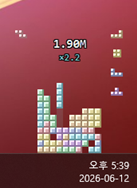

<p align="center"><b>English</b> · <a href="README.ko.md">한국어</a></p>

# Petris

A little tetris that soothes a heart worn down by vibe coding.

It plays itself in the corner of your screen. Typing speeds up the blocks and scores points. Daily totals go into a diary.

<p align="center"></p>

Windows only.

## Install

Grab `Petris.exe` from the [latest release](../../releases) and double-click. If SmartScreen warns, click "More info" → "Run anyway".

## Build

```
py -m pip install -r requirements.txt
py -m PyInstaller --clean --noconfirm Petris.spec
```

## License

MIT.
